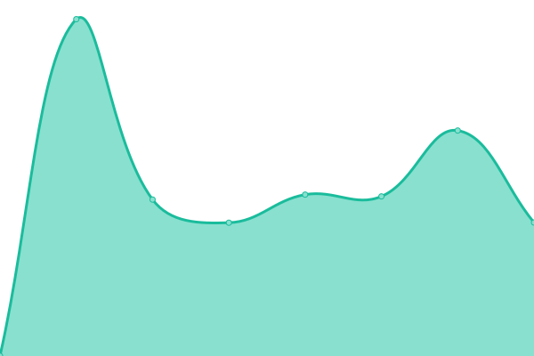

# [📈 Live Status](https://status.freifunk-suedholstein.de): <!--live status--> **🟩 All systems operational**

This repository contains the open-source uptime monitor and status page for [Freifunk Südholstein](http://freifunk-suedholstein.de), powered by [Upptime](https://github.com/upptime/upptime).

With [Upptime](https://upptime.js.org), you can get your own unlimited and free uptime monitor and status page, powered entirely by a GitHub repository. We use [Issues](https://github.com/ffsh/upptime/issues) as incident reports, [Actions](https://github.com/ffsh/upptime/actions) as uptime monitors, and [Pages](https://status.freifunk-suedholstein.de) for the status page.

<!--start: status pages-->
<!-- This summary is generated by Upptime (https://github.com/upptime/upptime) -->
<!-- Do not edit this manually, your changes will be overwritten -->
<!-- prettier-ignore -->
| URL | Status | History | Response Time | Uptime |
| --- | ------ | ------- | ------------- | ------ |
|  [Website](https://freifunk-suedholstein.de) | 🟩 Up | [website.yml](https://github.com/ffsh/uptime/commits/HEAD/history/website.yml) | 

 1139ms
     
 | 

<a href="https://status.freifunk-suedholstein.de/history/website">100.00%</a>
    

|  [Map](https://map.freifunk-suedholstein.de) | 🟩 Up | [map.yml](https://github.com/ffsh/uptime/commits/HEAD/history/map.yml) | 

 888ms
     
 | 

<a href="https://status.freifunk-suedholstein.de/history/map">100.00%</a>
    

|  [Firmware](https://firmware.freifunk-suedholstein.de) | 🟩 Up | [firmware.yml](https://github.com/ffsh/uptime/commits/HEAD/history/firmware.yml) | 

 760ms
     
 | 

<a href="https://status.freifunk-suedholstein.de/history/firmware">100.00%</a>
    

|  [Installer](https://install.freifunk-suedholstein.de) | 🟩 Up | [installer.yml](https://github.com/ffsh/uptime/commits/HEAD/history/installer.yml) | 

 737ms
     
 | 

<a href="https://status.freifunk-suedholstein.de/history/installer">100.00%</a>
    

|  [Mail](https://mail.freifunk-suedholstein.de) | 🟩 Up | [mail.yml](https://github.com/ffsh/uptime/commits/HEAD/history/mail.yml) | 

 1091ms
     
 | 

<a href="https://status.freifunk-suedholstein.de/history/mail">100.00%</a>
    

<!--end: status pages-->

[**Visit our status website →**](https://status.freifunk-suedholstein.de)

## 📄 License

- Powered by: [Upptime](https://github.com/upptime/upptime)
- Code: [MIT](./LICENSE) © [Freifunk Südholstein](http://freifunk-suedholstein.de)
- Data in the `./history` directory: [Open Database License](https://opendatacommons.org/licenses/odbl/1-0/)
