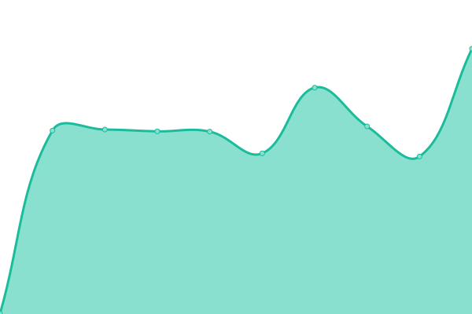

# [📈 Live Status](https://status.freifunk-suedholstein.de): <!--live status--> **🟧 Partial outage**

This repository contains the open-source uptime monitor and status page for [Freifunk Südholstein](http://freifunk-suedholstein.de), powered by [Upptime](https://github.com/upptime/upptime).

With [Upptime](https://upptime.js.org), you can get your own unlimited and free uptime monitor and status page, powered entirely by a GitHub repository. We use [Issues](https://github.com/ffsh/uptime/issues) as incident reports, [Actions](https://github.com/ffsh/uptime/actions) as uptime monitors, and [Pages](https://status.freifunk-suedholstein.de) for the status page.

<!--start: status pages-->
<!-- This summary is generated by Upptime (https://github.com/upptime/upptime) -->
<!-- Do not edit this manually, your changes will be overwritten -->

| URL                                                   | Status  | History                                                                              | Response Time                                                                  | Uptime                                                                                                                                                                                                              |
| ----------------------------------------------------- | ------- | ------------------------------------------------------------------------------------ | ------------------------------------------------------------------------------ | ------------------------------------------------------------------------------------------------------------------------------------------------------------------------------------------------------------------- |
| [Website](https://freifunk-suedholstein.de)           | 🟩 Up   | [website.yml](https://github.com/ffsh/uptime/commits/master/history/website.yml)     |  926ms   |      |
| [Map](https://map.freifunk-suedholstein.de)           | 🟥 Down | [map.yml](https://github.com/ffsh/uptime/commits/master/history/map.yml)             |  859ms       |              |
| [Firmware](https://firmware.freifunk-suedholstein.de) | 🟩 Up   | [firmware.yml](https://github.com/ffsh/uptime/commits/master/history/firmware.yml)   |  708ms  |    |
| [Installer](https://install.freifunk-suedholstein.de) | 🟩 Up   | [installer.yml](https://github.com/ffsh/uptime/commits/master/history/installer.yml) |  649ms |  |

<!--end: status pages-->

[**Visit our status website →**](https://status.freifunk-suedholstein.de)

## 📄 License

- Code: [MIT](./LICENSE) © [Freifunk Südholstein](http://freifunk-suedholstein.de)
- Data in the `./history` directory: [Open Database License](https://opendatacommons.org/licenses/odbl/1-0/)
